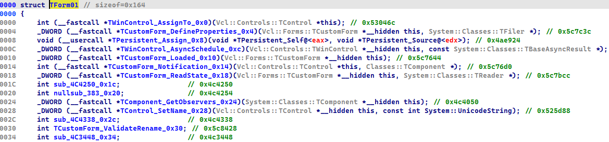

# DelphiHelper

DelphiHelper is a python IDA Pro plugin aiming to help the analysis of
x86/x86_64 binaries written in
[Delphi](https://www.embarcadero.com/products/delphi) programming language.

## Table of Contents


## Features

* Displays an interactive tree view of Delphi's DFM (Delphi Form Modules)
resource (Delphi Form description)
* Parses Delphi's RTTI data structures
* Extracts useful information from Delphi's RTTI data structures
* Extracts binary files embedded in Delphi's DFM resources
* Searches for the Entry Point (EP) function
* Loads Delphi's FLIRT signatures automatically
* Loads Interactive Delphi Reconstructor (IDR) Knowledge Base (KB) function
signatures 

## Installation

1. Copy `DelphiHelper` directory and `DelphiHelper.py` inside the IDA plugin
   directory:
   * on Windows: `%APPDATA%\Hex-Rays\IDA Pro\plugins\`
   * on macOS/Linux: `$HOME/.idapro/plugins/`
2. Download IDR Knowledge Base files manually by following 
   [instructions](#download-instructions) given below or run the script
   `setup_IDRKB.py`.

   > **_NOTE_**: `py7zr` installation is required to run the setup script: 
   `pip install py7zr`

**DelphiHelper** should be compatible with IDA 8.4 and later on Windows, macOS
and GNU/Linux.

## Usage

In order to use the DelphiHelper plugin, the resource section has to be loaded
in IDA. This can be achieved by checking the box **Load resources** or with the
option `-R` in the command line switch.


> **_NOTE_**: IDA autoanalysis must be completed before using the plugin.

### Hotkeys

* `<Alt-Shift-H>`: Print Help
* `<Alt-Shift-R>`: Run [VMT Parser](#vmt-parser)
* `<Alt-Shift-F>`: Run [DFM Finder](#dfm-finder) (show Delphi Form Viewer window)
* `<Alt-Shift-E>`: Run [Entry Point Function Finder](#entry-point-function-finder)
* `<Alt-Shift-S>`: Run [IDR Knowledge Base Loader](#idr-knowledge-base-loader) for `SysInit` and `System` unit
* `<Alt-Shift-A>`: Run [IDR Knowledge Base Loader](#idr-knowledge-base-loader)
for selected units

### VMT Parser

**Hotkey**: `<Alt-Shift-R>`

The **Virtual Method Table (VMT) Parser** must be executed with the cursor on
the starting address of a VMT structure. This structure can be located by
searching the functions named `CreateForm`, `CreateObject`, etc.; once the
function is found, the last argument should be the VMT structure.

In most cases there is a sequence of two instructions:
```
mov <register>, <VMTStructureOffset>
call CreateForm
```

For example:


Once on the structure (VMTStructureOffset e.g. `off_664A8C`), press `<Enter>`:


Press the hotkey `<Alt-Shift-R>`. The result looks like below:


The VMT structure contains a lot of useful information stored in various RTTI
tables. The most interesting ones are:
* [Field Table](#field-table)
* [Virtual Method Table (VMT)](#virtual-method-table-(vmt))
* [Method Table](#method-table)

The **VMT Parser** automatically extracts data from those tables and stores it
into IDA enums and structures. 

#### Field Table

The Field Table stores a name, a type and an offset of each published field.
The **VMT Parser** extracts and saves all these entries for each VMT structure
into IDA Enums:


The enums created by the **VMT Parser** have following format:
`%ObjectName%_Fields`. The names of enum entries have this format:
`%ObjectName%_%FieldType%_%FieldName%`:


The entries from enums created by the **VMT Parser** can be then named by
pressing built-in IDA shortcut `<M>`, used for naming symbolic constants.

**Before**


**After**


#### Virtual Method Table (VMT)

The Virtual Method Table stores pointers to all virtual methods declared for a
class and its base classes:


The **VMT Parser** extracts pointers from the VMT and saves them into an IDA
structure named by the parsed VMT structure. The names of structure entries
have the following format: `%MethodName%_%MethodOffset%`:



The entries from structures created by the **VMT Parser** can be then named by
pressing the built-in IDA shortcut `<T>`, used for naming structure offsets.

**Before**


**After**


#### Method Table

The Method Table stores names and pointers of published methods. The Method
Table also contains pointers of Delphi Event handlers that can be found and
accessed from the **Delphi Form Viewer** (for more info see [DFM
Finder](#dfm-finder))


### DFM Finder

**Hotkey**: `<Alt-Shift-F`

The **DFM Finder** tries to find all DFMs stored in a resource section of the
analyzed Delphi binary and after that it runs the **VMT Parser** on all VMT
structures associated with found DMFs. After all VMT structures are processed,
a new interactive IDA subview (**Delphi Form Viewer**) is displayed. The
subview shows a tree view of Delphi Form descriptions extracted from DFM:


**Bold** nodes represent components that have some Delphi Event defined.
Follow such bold nodes deeper in a subtree until you spot bold `Properties`
node, where you can find a blue colored Delphi Event. By clicking on the Event
item, you are moved to a corresponding Event handler in the IDA Disassembly
window.

**Green** nodes represent components which have some binary file embedded.
Follow such green nodes deeper in a subtree until you spot green `Properties`
node, where you can find a green colored item. The item shows a file path of
the embedded binary file dropped by **DFM Finder**. The destination
subdirectory for extracted files is located in current IDA working directory
and has the following format:
`%IDAWorkingDirectory%\_extracted_%BinaryFileName%\` 

Click on a root (Form's) node in Delphi Form Viewer window moves you to the
Form's VMT structure in the IDA Disassembly window.

### Entry Point Function Finder

**Hotkey**: `<Alt-Shift-E>`

**Entry Point Function Finder** tries to find possible entry point functions by
searching for references to `CreateFrom`, `InitExe` and `InitLib` calls.
Results are presented in IDA's output window, e.g.:  


### IDR Knowledge Base Loader

**Hotkeys**: `<Alt-Shift-S>` and  `<Alt-Shift-A>`

**IDR Knowledge Base Loader** loads IDR KB signatures from KB files. The plugin 
expects to have the KB files stored in the following location:

* on Windows: `%APPDATA%\Hex-Rays\IDA Pro\plugins\DelphiHelper\IDR_KB\`

* on macOS/Linux: `$HOME/.idapro/plugins/DelphiHelper/IDR_KB/`

`<Alt-Shift-S>` loads function signatures for only `SysInit` and `System`.

`<Alt-Shift-A>` tries to load function signatures for all units selected from a
list of imported units.

> **_NOTE_**: The KB files are downloaded from the IDR project:<br>
> https://github.com/crypto2011/IDR<br>
> https://github.com/crypto2011/IDR64

The IDR project is licensed under the MIT license:
``` 
MIT License

Copyright (c) 2006-2018 crypto

Permission is hereby granted, free of charge, to any person obtaining a copy
of this software and associated documentation files (the "Software"), to deal
in the Software without restriction, including without limitation the rights
to use, copy, modify, merge, publish, distribute, sublicense, and/or sell
copies of the Software, and to permit persons to whom the Software is
furnished to do so, subject to the following conditions:

The above copyright notice and this permission notice shall be included in all
copies or substantial portions of the Software.

THE SOFTWARE IS PROVIDED "AS IS", WITHOUT WARRANTY OF ANY KIND, EXPRESS OR
IMPLIED, INCLUDING BUT NOT LIMITED TO THE WARRANTIES OF MERCHANTABILITY,
FITNESS FOR A PARTICULAR PURPOSE AND NONINFRINGEMENT. IN NO EVENT SHALL THE
AUTHORS OR COPYRIGHT HOLDERS BE LIABLE FOR ANY CLAIM, DAMAGES OR OTHER
LIABILITY, WHETHER IN AN ACTION OF CONTRACT, TORT OR OTHERWISE, ARISING FROM,
OUT OF OR IN CONNECTION WITH THE SOFTWARE OR THE USE OR OTHER DEALINGS IN THE
SOFTWARE.
```

#### Download instructions

Download and copy following KB files into `DelphiHelper\IDR_KB\IDR64\`
directory:<br>
https://github.com/crypto2011/IDR64/blob/master/syskb2012.bin<br>
https://github.com/crypto2011/IDR64/blob/master/syskb2013.bin<br>
https://github.com/crypto2011/IDR64/blob/master/syskb2014.bin<br>

Download and **extract** following KB files into `DelphiHelper\IDR_KB\IDR\`
directory:<br>
https://github.com/crypto2011/IDR/blob/master/kb2005.7z<br>
https://github.com/crypto2011/IDR/blob/master/kb2006.7z<br>
https://github.com/crypto2011/IDR/blob/master/kb2007.7z<br>
https://github.com/crypto2011/IDR/blob/master/kb2009.7z<br>
https://github.com/crypto2011/IDR/blob/master/kb2010.7z<br>
https://github.com/crypto2011/IDR/blob/master/kb2011.7z<br>
https://github.com/crypto2011/IDR/blob/master/kb2012.7z<br>
https://github.com/crypto2011/IDR/blob/master/kb2013.7z<br>
https://github.com/crypto2011/IDR/blob/master/kb2014.7z
